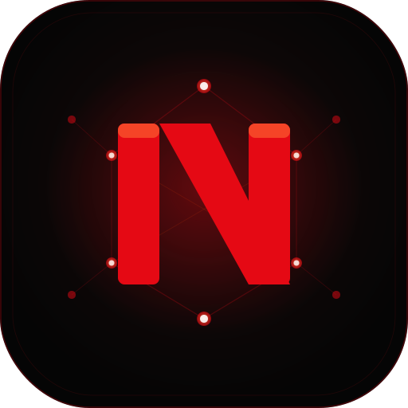

<div align="center">



# NeuroStream AI

### A production-grade AI-powered desktop media streaming platform

> **The intersection of Netflix, VLC, Spotify, and an intelligent assistant — built from scratch.**

[](https://react.dev)
[](https://electronjs.org)
[](https://expressjs.com)
[](https://vitejs.dev)
[](https://github.com/pmndrs/zustand)
[](LICENSE)
[]()
[](https://github.com/Unwilling-mcu/NeuroStream-Ai)

[Features](#-features) • [Architecture](#-architecture) • [Getting Started](#-getting-started) • [Keyboard Shortcuts](#%EF%B8%8F-keyboard-shortcuts) • [Roadmap](#-roadmap)

</div>

---

## 🎯 What Is This?

NeuroStream AI is a **fully-featured desktop media platform** built with a modern full-stack architecture. It combines:

- 🎬 **Netflix-style UI** — grid library, hover previews, continue watching, quality badges
- 🎵 **VLC-grade playback** — local files, network URLs, all formats, chapter markers
- 🟢 **Spotify integration** — browse playlists, search and stream tracks in-app
- 🤖 **AI-powered assistant** — voice commands to control everything hands-free
- 👥 **Watch Together** — sync playback across tabs or devices in real time

---

## ✨ Features

### 🎬 Video Playback
- Chunked HTTP streaming with range request support
- Supports **MP4, MKV, AVI, MOV, WebM, M4V, FLV**
- Custom-built player — no browser default controls
- **Aspect ratio modes**: 16:9, Fill, 4:3, 21:9, Stretch
- **Quality selector** (144p → 4K) with NATIVE badge
- Playback speed 0.25x → 3x — **remembered per session**
- Brightness control, zoom modes
- **Double-click to fullscreen**, **P for Picture-in-Picture**
- Chapter markers on progress bar (MKV/MP4)
- Screenshot capture (S key or button)
- Auto-play next with 5-second cancellable banner
- **Video bookmarks** — save timestamps with notes (B key)
- **Video notes** — timestamped text notes per video

### 🎵 Audio Player
- Full audio library with MP3, FLAC, WAV, AAC, OGG, M4A
- **Real album art** extracted from ID3 tags
- Artist, album, duration metadata display
- **Audio queue** — prev/next/loop/shuffle
- **Loop modes**: None, Loop One, Loop All
- **10-band Equalizer** with presets (Bass Boost, Rock, Jazz, Pop, Classical...)
- **Audio Visualizer** — bars, wave, circle modes (Web Audio API)
- **Crossfade** between tracks (600ms smooth fade)
- **Lyrics display** — auto-fetched from lyrics.ovh API
- Sort by Title, Artist, Album, Duration
- Keyboard: `A` = play/pause audio, `N` = next track

### 🟢 Spotify Integration
- Connect via Spotify Web API (free Developer account)
- Browse all your playlists with cover art
- Search songs, artists, albums
- **Stream tracks directly** via Spotify Web Playback SDK (Premium)
- Now playing bar with progress, volume, prev/next controls

### 👥 Watch Together
- Create or join a sync room with a Room ID
- Share Room ID with friends — playback syncs automatically
- Play, pause, seek events broadcast to all room members
- Works across browser tabs (BroadcastChannel) — WebSocket server for remote devices

### 🖥 Desktop Integration
- Native **folder picker** — scans all videos and audio files
- **Drag & drop** media files directly onto the app
- **Remember last folder** — auto-restores on every launch
- **Recent files** — quick-open last 20 played files
- Custom frameless window with branded titlebar
- `file://` URL streaming — no server needed for local files
- Cross-platform: Windows, macOS, Linux

### 🌐 Network & Streaming
- Paste any direct video URL to play instantly
- Built-in sample videos for testing
- Backend Express streaming with `206 Partial Content`

### 🖼 Library & Metadata
- **Real thumbnail generation** via ffprobe/ffmpeg
- Lazy thumbnail loading with shimmer skeleton
- **Album art** extraction from audio file ID3 tags
- Resolution, duration, file size, codec metadata
- Quality badges: 4K / 2K / FHD / HD / SD
- Hover-to-preview with muted autoplay
- Sort by Name / Duration / Size / Date
- **NEW badge** on files added in last 24 hours
- Search across entire library
- Remove from library (file on disk untouched)

### ⏱ Watch History
- Auto-saves progress every 5 seconds
- Restores position on re-open
- Thumbnail preview on Continue Watching rows
- Watch count, last watched date
- Remove individual entries or clear all
- **Export as CSV** spreadsheet

### 🎤 Voice Assistant (Jarvis Mode)
- Continuous listening — stays active until closed
- Live animated waveform bars while listening
- Text-to-speech responses
- Commands: `play`, `pause`, `next`, `back`, `mute`, `fullscreen`, `home`, `library`, `volume up/down`, `faster`, `slower`, `close`, `search for [title]`
- `?` help panel listing all commands

### 🎨 UI & Themes
- **5 themes**: Dark, AMOLED Black, Navy Blue, Forest Green, Midnight Purple
- Netflix-style sidebar with animated N logo glow
- Glassmorphism panels with blur effects
- Smooth page transitions and card animations
- Queue panel, Playlist panel with shuffle
- Sleep timer with countdown and presets
- Keyboard shortcuts overlay (press `?`)
- Toast notifications for all actions
- OS notifications on track change

---

## 🏗 Architecture

```
NeuroStream AI/
├── frontend/                    # React + Vite (UI)
│   ├── src/
│   │   ├── components/
│   │   │   ├── VideoPlayer.jsx      # Full custom player
│   │   │   ├── VideoCard.jsx        # Hover preview + context menu
│   │   │   ├── AudioVisualizer.jsx  # Web Audio API visualizer
│   │   │   ├── Equalizer.jsx        # 10-band EQ with presets
│   │   │   ├── SleepTimer.jsx       # Auto-stop timer
│   │   │   ├── VideoBookmarks.jsx   # Timestamp bookmarks
│   │   │   ├── MediaUtils.jsx       # Loop, Recent, Notes, Lyrics
│   │   │   ├── SpotifyPage.jsx      # Spotify Web API integration
│   │   │   ├── MiniPlayer.jsx       # Floating mini player bar
│   │   │   ├── Sidebar.jsx          # Navigation
│   │   │   ├── TitleBar.jsx         # Custom window chrome
│   │   │   └── VoiceAssistant.jsx   # Jarvis voice control
│   │   ├── store/
│   │   │   └── useAppStore.js       # Zustand global state
│   │   ├── App.jsx                  # Root layout + all pages
│   │   └── index.css                # Themes + animations
│   └── package.json
│
├── backend/                     # Node.js + Express (API)
│   ├── server.js                # Streaming, metadata, thumbnails
│   ├── thumbnails/              # Auto-generated (gitignored)
│   └── package.json
│
├── electron/                    # Desktop shell
│   ├── main.js                  # Window + IPC handlers
│   ├── preload.js               # Secure context bridge
│   ├── splash.html              # Cinematic intro screen
│   └── package.json
│
└── README.md
```

### Technology Stack

| Layer | Technology | Purpose |
|---|---|---|
| UI Framework | React 18 + Vite 5 | Component rendering |
| State | Zustand 4 + persist | Global state, localStorage sync |
| Desktop | Electron 30 | Native window, file system |
| Backend | Express 4 | Streaming, metadata, API |
| Metadata | ffprobe-static | Duration, resolution, codec |
| Thumbnails | fluent-ffmpeg | Frame extraction |
| Database | JSON file | Watch history, library |
| Audio | Web Audio API | Equalizer, Visualizer |
| Streaming | Spotify Web API | Music playback |
| Voice | Web Speech API | STT + TTS |

---

## 🚀 Getting Started

### Prerequisites
- **Node.js** v18+ (v22 recommended)
- **npm** v9+
- Windows 10/11, macOS, or Linux

### Installation

```bash
# Clone
git clone https://github.com/Unwilling-mcu/NeuroStream-Ai.git
cd NeuroStream-Ai

# Install all dependencies
cd backend && npm install && cd ..
cd frontend && npm install && cd ..
cd electron && npm install && cd ..
```

### Running

Open **3 terminals**:

```bash
# Terminal 1 — Backend
cd backend && npm start
# → http://localhost:5000

# Terminal 2 — Frontend
cd frontend && npm run dev
# → http://localhost:5173

# Terminal 3 — Electron
cd electron && npm start
```

### Building .exe Installer

```bash
cd frontend && npm run build
cd ../electron && npm run build:win
# Output → electron/dist-build/
```

---

## ⌨️ Keyboard Shortcuts

| Key | Action |
|---|---|
| `Space` / `K` | Play / Pause video |
| `←` / `J` | Rewind 10s |
| `→` / `L` | Forward 10s |
| `↑` / `↓` | Volume up / down |
| `M` | Toggle mute |
| `F` | Fullscreen |
| `P` | Picture-in-Picture |
| `S` | Screenshot |
| `B` | Add bookmark |
| `A` | Play/Pause audio |
| `N` | Next audio track |
| `,` / `.` | Speed decrease / increase |
| `Esc` | Close / Exit |
| `?` | Shortcuts panel |

---

## 🗺 Roadmap

### 🔴 In Progress
- [ ] HLS/DASH adaptive streaming with server-side ffmpeg transcoding
- [ ] Auto subtitle generation via Whisper API
- [ ] Electron `.exe` packaged installer with auto-updater
- [ ] React Native mobile companion app

### 🟡 Planned
- [ ] Apple Music integration (requires Apple Developer account)
- [ ] AI-based video recommendations from watch history
- [ ] Scene detection and highlight generation
- [ ] Multi-user profiles with separate libraries
- [ ] File association — open `.mp4` directly in NeuroStream
- [ ] WebRTC multi-device Watch Together
- [ ] Plugin system for extensible features
- [ ] Cloud sync for watch history

### 🟢 Research
- [ ] Emotion/genre AI classification
- [ ] Content summarization (AI descriptions)
- [ ] WebRTC co-watching with video chat

---

## 🤝 Contributing

1. Fork the repository
2. Create a branch: `git checkout -b feature/amazing-feature`
3. Commit: `git commit -m 'Add amazing feature'`
4. Push: `git push origin feature/amazing-feature`
5. Open a Pull Request

---

## 📄 License

MIT License — see [LICENSE](LICENSE) for details.

---

## 👨‍💻 Author

**Riju** — [@Unwilling-mcu](https://github.com/Unwilling-mcu)

> *Built as a showcase of full-stack desktop application engineering — combining React, Electron, Express, Web Audio API, Spotify API, and AI-powered voice control into a single production-grade application.*

---

<div align="center">

⭐ **Star this repo if you found it useful — it helps others discover it!** ⭐

</div>